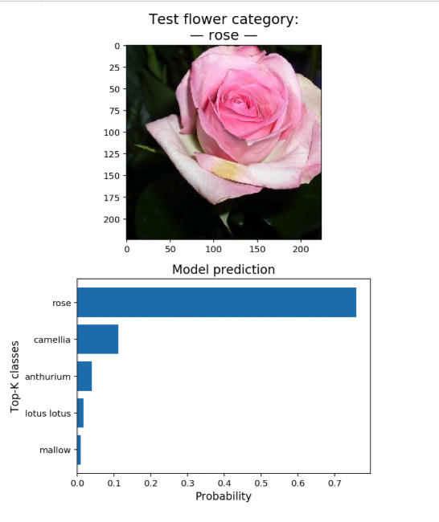

# Flower Image Classifier with [PyTorch](https://pypi.org/project/torch/0.1.2/)

## Application of neural networks for image classification—using [`torchvision`](https://pytorch.org/docs/0.3.0/torchvision/index.html)


### Example of inference:

<p align="center">
  
</p>

This project is part of a [Udacity](https://www.udacity.com/) program: [Data Science degree, Project 2](https://github.com/udacity/DSND_Term1)

The objective of this project is to build an application that can be trained on any set of labeled images, using tools in [PyTorch](https://pypi.org/project/torch/0.1.2/)

The network instance in the Jupyter notebook is trained on flower images—[102 Category Flower Dataset](http://www.robots.ox.ac.uk/~vgg/data/flowers/102/index.html)—and provides predictions via a command line application. Below is an example of the type of images included in the dataset:

<p align="center">
  
</p>

The project in the Jupyter notebook is broken down into three main steps:

1. Load and pre-process the image datasets
2. Train the image classifier on the training dataset
3. Use the trained classifier to predict flower-image categories

Main files in the repository:

- `flower-classifier-PyTorch.ipynb`: Jupyter notebook including main Python code used in developing the tool.

- `model_functions.py`: Python module with functions needed for core tasks of the model: network architecture, building a classifier, training, validation, and prediction.

- `train.py`: Python module to train a new network on a dataset and then save the model as a checkpoint.

- `utility_fs_train.py`: Utility functions for `train.py`.

- `predict.py`: Python module to predict flower category from image, along with the probability of that category.

- `utility_fs_predict.py`: Utility functions for `predict.py`.


## Data Science motivation

The objective of this project is to build an application that can be trained on any set of labeled images, using the tool in [PyTorch](https://pypi.org/project/torch/0.1.2/).


## Use Jupyter Notebook

The Jupyter Project highly recommends new users to install [Anaconda](https://www.anaconda.com/distribution/); since it conveniently installs Python, the Jupyter Notebook, and other commonly used packages for scientific computing and data science.

Use the following installation steps:

1. Download Anaconda.

2. Install the version of Anaconda which you downloaded, following the instructions on the download page.

3. To run the notebook:

```bash
jupyter notebook flower-classifier-PyTorch.ipynb
```


## Use `train.py`

```bash
python train.py <data_directory> \
		--arch <network architecture> \
		--save_dir <checkpoint directory> \
		--learning_rate <learning rate> \
		--hidden_units <units in hidden layer pre-classifier> \
		--epochs <number of passes of the training data> \
		--gpu
```

### Example of basic use:

```bash
python train.py flowers/ 
```


## Use `predict.py`

```bash
python predict.py <path to image> <checkpoint> \
		--top_k <number of most likely classes> \
		--category_names <mapping of categories to real names> \
		--gpu
```

### Example of basic use:

```bash
python predict.py input_image checkpoint --top_k 3 --gpu \
		--category_names cat_to_name.json
```


## Python version

3.7.1 (default, Oct 23 2018, 14:07:42) 


## Python libraries

The Jupyter Notebook and the Python modules require the following Python libraries:

- argparse
- collections
- json
- matplotlib
- numpy
- os
- pandas
- PIL
- random
- sklearn
- sys
- time
- torch
- torchvision


## Acknowledgments

- [Udacity: Data Scientist Nanodegree program](https://www.udacity.com/course/data-scientist-nanodegree--nd025).
- Jupyter Documentation: [Installing Jupyter Notebook](https://jupyter.readthedocs.io/en/latest/install.html)


## Author

Juan Carlos Lopez
[GitHub](https://github.com/jclh/)
[LinkedIn](https://www.linkedin.com/in/jclopezh/)
jc.lopezh@gmail.com


## Contributing

1. Fork it (https://github.com/jclh/image-classifier-PyTorch/fork)
2. Create your feature branch (git checkout -b feature/fooBar)
3. Commit your changes (git commit -am 'Add some fooBar')
4. Push to the branch (git push origin feature/fooBar)
5. Create a new Pull Request


